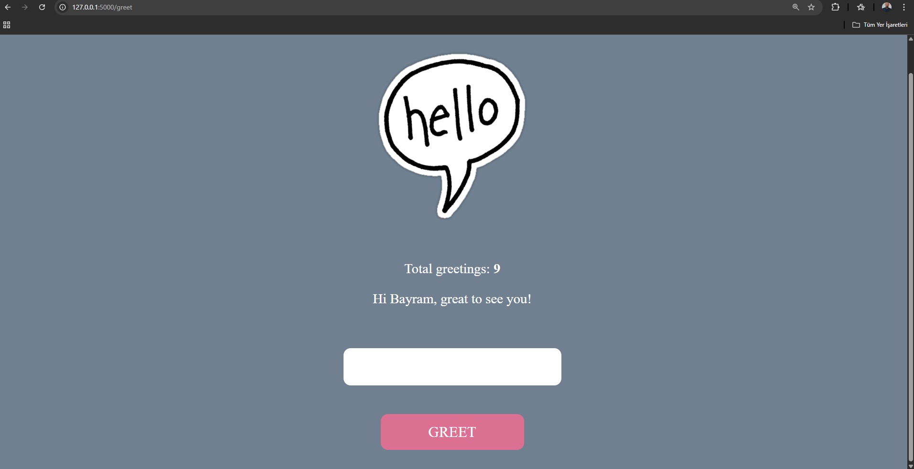

# Flask Greeting App with Visitor Counter  

Live Demo 🚀 (https://flask-greeter-app-f7hw.onrender.com/hello) | [](LICENSE) 

Enhanced version of [Python Simplified's Flask Tutorial](https://www.youtube.com/watch?v=6plVs_ytIH8&list=FLUlfchq2F5t_LmXuw1IXbFA&index=2) with new features.  

 <!-- Add this line if you have screenshot -->

## ✨ My Enhancements  

- ✅ Added SQLite visitor counter  
- ✅ Fixed CSS alignment issues from tutorial  
- ✅ Improved form validation  
- ✅ Deployed to Render for production readiness
  
🛠 Built With
Python/Flask

SQLite

HTML/CSS

📚 Tutorial Credit
Original tutorial by Python Simplified.

## 🚀 Run Locally  

```bash  
pip install -r requirements.txt  
flask run  
